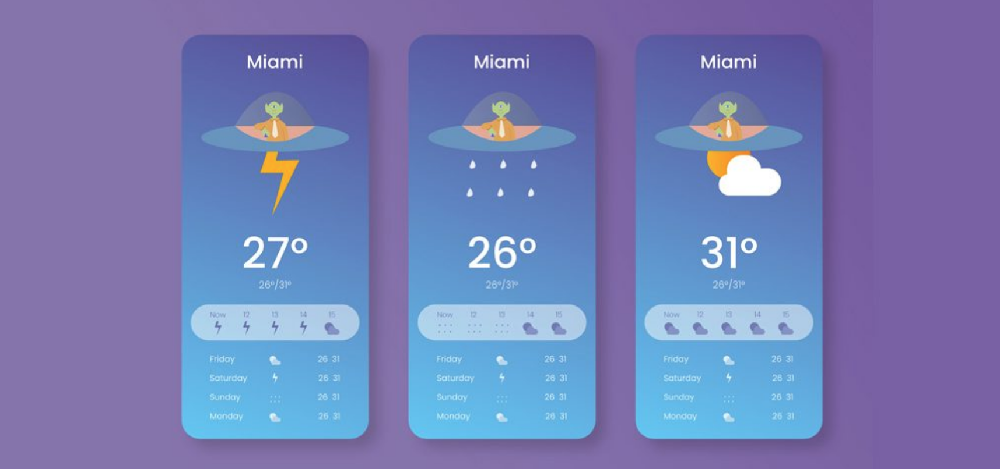

# PROJECT 2 README <!-- omit in toc -->

- [Project Planning](#project-planning)
  - [Overview](#overview)
  - [Wireframes](#wireframes)
  - [MVP](#mvp)
    - [Goals](#goals)
    - [Libraries](#libraries)
    - [Data](#data)
    - [Component Hierarchy](#component-hierarchy)
    - [Component Breakdown](#component-breakdown)
    - [Component Estimates](#component-estimates)
    - [Helper Functions](#helper-functions)
  - [Post-MVP](#post-mvp)
- [Project Delivery](#project-delivery)
  - [Code Showcase](#code-showcase)
  - [Code Issues & Resolutions](#code-issues--resolutions)

## Project Planning

> This section should be completed for your project pitch with instructors.
>
> To ensure correct Markdown, it's recommended that you copy and paste the raw template code. The content provided is example content ONLY. You must make changes to all sections as they relate to your own project.

<br>

### Overview

**Project Title** 
Apollo Weather

**Project Description** Apollo weather is an app that displays weather.  A user will be able to search a city and render a 5 day forecast. It will include images for different weather conditions.

<br>

### Wireframes

> Use the Wireframes section to display desktop, tablet and mobile views.



- App Layout


<br>

### MVP

> The Minimum Viable Product should be a well-planned and easily-communicated product, ensuring that the client's deliverable will be achievable and meet specifications within the time frame estimated.

_The **Apollo Weather** MVP_
- Users will be able to search by city
- Upon searching, different weather updates for each city will be rendered
- A high and low forecast for the specific city will be displayed
- Users will get weather based on location
- Display will include temperature readings, weather icons and list the current weather status.

<br>

#### Goals

- _Sucessfully create 5 components_
- _Successfully choose and call working API_
- _Create a clean, readable display._
- _etc._

<br>

#### Libraries

> Use this section to list all supporting libraries and their role in the project.

|     Library      | Description                                |
| :--------------: | :----------------------------------------- |
|   React Router   | _Lorem ipsum dolor sit amet, consectetur._ |
| " | _Lorem ipsum dolor sit amet, consectetur._ |
| unix-timestamp | _Lorem ipsum dolor sit amet, consectetur._ |

|   Axios   | _Lorem ipsum dolor sit amet, consectetur._ |

<br>

#### Data
https://www.programmableweb.com/api/weather-channel
https://openweathermap.org/appid
> Use the Data Section to define the API(s) you will be consuming for your project, inluding sample URL queries.

|    API     | Quality Docs? | Website       | Sample Query                            |
| :--------: | :-----------: | :------------ | :-------------------------------------- |
| WeatherAPI |      yes      | _https://openweathermap.org/current_ | _/data/2.5/weather?q={city name}&appid={your api key}_ |

```
JSON data sample from your API goes here.
```

<br>

#### Component Hierarchy

> Use this section to define your React components and the data architecture of your app.

```
src
|__ assets/
      |__ data-tests
      |__ fonts
      |__ graphics
      |__ images
      |__ mockups
|__ components/
      |__ App.jsx
      |__ Search.jsx
      |__ Forecast.jsx
      |__ Weather.jsx
      |__ Date.jsx
```

<br>

#### Component Breakdown

> Use this section to go into further depth regarding your components, including breaking down the components as stateless or stateful, and considering the passing of data between those components.

|  Component   |    Type    | State | Props | Description                                                      |
| :----------: | :--------: | :---: | :---: | :--------------------------------------------------------------- |
|    App       | functional |   n   |   n   | _Initial file to implement the server._               |
|  Search      | functional |   n   |   n   | _Search bar used to find specific cities._       |
|   Forecast   |   class    |   y   |   n   | _A 5-day span of weather conditions._      |
| Weather      | functional |   n   |   y   | _Display's current weather based on location_
|    Date      | functional |   n   |   n   | _Displays current Date._ |

<br>

### Post-MVP

- Adding more components
- Rsponsive Background
- Sunrise/Sunset information
- Responsive Icons

> Use this section to document ideas you've had that would be fun (or necessary) for your Post-MVP. This will be helpful when you return to your project after graduation!

- _Storybook and Tests._

<br>

***

## Project Delivery

### Code Showcase

> Use this section to include a brief code snippet of functionality that you are proud of and a brief description.

```
code snippet here
```

### Code Issues & Resolutions

> Use this section to list of all major issues encountered and their resolution, if you'd like.